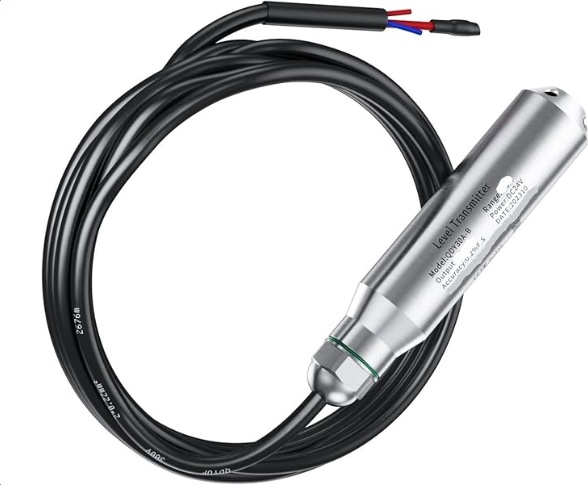

# QDY30A Liquid Level Transmitter - Technical Specification

*Available on Amazon: https://a.co/d/4JelvCt*   (But, I got off AliExpress for ~$30)

---

## 1. Introduction

The QDY30A Liquid Level Sensor Transmitter is a high-precision device designed for continuous and accurate measurement of liquid levels, particularly in water tanks. Utilizing hydrostatic pressure principles, it converts the measured pressure into a standard electrical output signal (4-20mA, 0-10V, or RS485), making it suitable for various industrial and domestic monitoring applications. Its robust 304 stainless steel construction and IP68 protection ensure reliable performance in demanding environments.

---

## 2. Product Overview

The QDY30A sensor consists of a robust stainless steel probe, an integrated cable, and internal electronics for signal conditioning. The probe is designed to be submerged in the liquid, where it measures the hydrostatic pressure, which is directly proportional to the liquid level above the sensor.

### Atmospheric Vent Tube - CRITICAL FEATURE

A key component within the cable is the **red ventilation tube** (also known as a vent tube, breather tube, or capillary tube). This tube provides an open path to atmospheric pressure, allowing the sensor to compensate for changes in ambient air pressure above the liquid surface.

**Purpose:**
- Ensures the device measures true hydrostatic pressure from the liquid level (gauge pressure relative to atmosphere) rather than absolute pressure
- Prevents inaccuracies due to weather, elevation changes, or barometric variations

**Important:**
- The red vent tube must remain **dry, open, and unblocked** at the exposed end
- If the tube becomes clogged, submerged, or damaged, it will lead to erroneous readings
- Keep the vent tube end in a protected, dry location above the maximum liquid level

### Available Configurations

- Output options: 4-20mA current output, 0-10V voltage output, or RS485 for digital communication
- Cable length: Customizable, commonly ranging from 5m upwards

---

## 3. Technical Specifications

| Parameter | Details |
|:----------|:--------|
| **Model** | QDY30A (variants include QDY30A-B, etc.) |
| **Type** | Submersible Liquid Level Transmitter |
| **Measured Medium** | Water, oil, fuels, or other non-corrosive liquids |
| **Measuring Range** | 0-1m to 0-500m (customizable; common: 0-5m, 0-10m, etc.) |
| **Accuracy** | 0.2% FS (Full Scale) |
| **Output Signals** | 4-20mA, 0-10V, 0-5V, 1-5V, RS485 (Modbus optional) |
| **Power Supply** | 12-36VDC (default 24VDC) |
| **Ambient Temperature** | -30°C to 80°C |
| **Temperature Compensation** | -10°C to 70°C |
| **Overload Capacity** | <200% FS |
| **Protection Level** | IP68 |
| **Long-term Stability** | ±0.2% FS/year |
| **Material** | 304 Stainless Steel (probe); optional 316SS or PTFE for corrosive media |
| **Probe Diameter** | Approximately 22-28mm |
| **Cable Length** | Customizable, typically 5m longer than range |
| **Certification** | CE (where applicable) |

*Note: Specifications may vary slightly by variant; refer to specific model for exact details.*

---

## 4. Setup

### 4.1 Unpacking and Inspection

Carefully remove the sensor and inspect the body, cable, and connections for physical damage. Verify the red vent tube is intact and unobstructed.

### 4.2 Wiring

⚠️ **Disconnect power before wiring**

**Wire Color Codes:**
- **Red Wire:** Positive power supply (V+)
- **Black/Blue Wire:** Ground/common (GND)

**Configuration-Specific Wiring:**
- **4-20mA (Two-wire):**
  - Red: Signal + Power
  - Black: GND
- **0-10V (Three-wire):**
  - Red: Power (12-36VDC)
  - Blue: GND
  - White: Signal output
- **RS485:** Additional wires for A/B data lines

### 4.3 Installation Environment and Mounting

**Submersion:**
- Lower the sensor into the liquid, ensuring the sensing head is below the minimum expected liquid level
- The entire stainless steel probe should be submerged for accurate readings

**Cable Management:**
- Secure the cable to prevent movement, damage, or strain
- Route cable away from sharp edges or moving parts
- Use cable ties or conduit for protection

**Ventilation Tube (CRITICAL):**
- Keep the red vent tube's open end in a **protected, dry location** above the maximum liquid level
- Ensure atmospheric pressure reference is maintained
- Protect vent tube from water, dust, and debris
- Do not seal or cap the vent tube end

---

## 5. Operating Instructions

### 5.1 Powering On

The sensor begins measuring immediately upon applying the specified DC power (12-36VDC, typically 24VDC).

### 5.2 Reading Output

The output is linear to the liquid level:

**4-20mA Output:**
- 4mA = zero level (sensor at liquid surface)
- 20mA = full scale (maximum rated depth)
- Linear scaling between 4-20mA

**0-10V Output:**
- 0V = zero level
- 10V = full scale
- Linear scaling between 0-10V

**RS485 Output:**
- Digital readout via Modbus protocol
- Refer to Modbus register map for configuration

### 5.3 Calibration

The sensor is factory-calibrated and rarely needs recalibration. If recalibration is necessary, consult the manufacturer or use a precision reference depth.

---

## 6. Maintenance

**Regular Maintenance:**
- Clean the probe periodically to remove sediment, algae, or mineral buildup
- Use mild soap and water; avoid abrasive cleaners
- Inspect the cable for damage, especially the red vent tube
- Check vent tube for blockages or moisture intrusion

**Storage:**
- Store in a cool, dry place when not in use
- Protect the vent tube from contaminants
- Coil cable loosely to prevent kinking

**Inspection Schedule:**
- **Monthly:** Visual inspection of cable and vent tube
- **Quarterly:** Clean probe, verify readings
- **Annually:** Full system test and accuracy verification

---

## 7. Troubleshooting

| Problem | Possible Cause | Solution |
|:--------|:---------------|:---------|
| **No Output** | Power issues, wiring errors, sensor damage | Check power supply voltage, verify wiring polarity, inspect for physical damage |
| **Inaccurate Readings** | Dirt on probe, blocked vent tube, improper scaling, atmospheric pressure compensation failure | Clean probe thoroughly, clear and dry vent tube, verify voltage divider scaling in controller |
| **Intermittent Readings** | Loose connections, cable damage (including vent tube), unstable power supply | Secure all connections, inspect cable and vent tube integrity, stabilize power source |
| **Reading Too High** | Vent tube blocked or wet, probe fouled | Clear vent tube, dry vent tube end, clean probe sensing element |
| **Reading Drifts** | Temperature changes, vent tube moisture, sensor aging | Allow sensor to temperature stabilize, check vent tube is dry, verify calibration |

---

## 8. Application Notes

**For Sump Pump Control Applications:**
- Typical range: 0-1m (0-3.28 feet) or 0-2m (0-6.56 feet)
- Output: 0-10V recommended for easy interfacing with ADC modules
- Voltage divider required: 0-10V output must be scaled to 0-3.3V for ESP32/ADC inputs
- Recommended divider: 20kΩ + 10kΩ resistors with 2.2µF filtering capacitor

**Vent Tube Protection Methods:**
- Install desiccant pack in vent tube termination enclosure
- Use waterproof cable gland with vent tube pass-through
- Route vent tube to dry, elevated location
- Consider using a small air-permeable membrane filter

**Output Verification:**
- For 0-10V sensor with 1m range: 10V output = 1m depth
- Expected output at 0.5m depth: 5V
- Expected output at 0.25m depth: 2.5V

---

## 9. Product Variants

**QDY30A Series Models:**
- **QDY30A:** Standard version, 4-20mA output
- **QDY30A-B:** 0-10V voltage output (recommended for microcontroller applications)
- **QDY30A-RS485:** Digital RS485 Modbus output

**Common Configurations:**
- 0-1m range / 0-10V output (ideal for residential sump pits)
- 0-5m range / 4-20mA output (commercial/industrial applications)
- 0-10m range / RS485 output (SCADA integration)

---

**Document Version:** 1.0
**Last Updated:** 2025-11-05
**Source:** QDY30A Specification Sheet (translated and condensed)
**Purchase Link:** Amazon - https://a.co/d/4JelvCt
