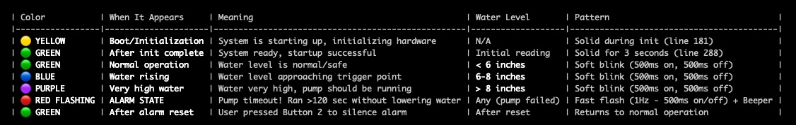

# Sump Monitor Controller
**ESP32-S2 Version for Adafruit Feather ESP32-S2 TFT**

## Overview
Automatic sump pump controller with water level monitoring, timeout protection, and alarm system.

## Hardware Requirements
- **Adafruit Feather ESP32-S2 TFT** (240x135 ST7789 display, built-in NeoPixel - disabled)
- **ADS1115** 16-bit ADC module (I2C)
- **0-10V Water Level Sensor** with voltage divider (20kΩ, 10kΩ, 2.2µF cap - see QuickConnections.txt)
  - See Amazon for example: https://a.co/d/4JelvCt (QDY30A 0-10V 1M sensor)
- **5V Relay Module** (active-high)
- **Piezo Beeper**
- **2 Push Buttons** (NO, momentary)
- **External NeoPixel** on GPIO 11 (optional but recommended for status indication)

## Features
- **Automatic Pump Control**: Turns pump on at 5" water level, off at 3"
- **Timeout Protection**: 120-second maximum runtime with alarm
- **Visual Status**: External NeoPixel shows system status (Green=OK, Red=Alarm, Blue=High Water)
- **Audible Alarm**: Beeper sounds if pump times out
- **Historical Data**: Tracks pump runtime for last 5 days
- **WiFi Time Sync**: Timestamps pump runs via NTP (displays in 12-hour format with AM/PM)
- **WiFi Signal Strength**: Displays RSSI in dBm on status screen
- **Manual Override**: Button for manual pump control
- **TFT Display**: Real-time water level, status, and statistics

## Quick Start
1. **Install Arduino Libraries**:
   - Adafruit_GFX
   - Adafruit_ST7789
   - Adafruit_ADS1X15
   - Adafruit_NeoPixel
   - WiFi (built-in)
   - Preferences (built-in)

2. **Wire Hardware**: See `feather_wiring_diagram.md` for complete wiring guide or `QuickConnections.txt` for quick reference

3. **Configure Sketch**:
   - Edit WiFi credentials in sketch (lines 48-49)
   - Adjust thresholds if needed (TRIGGER_INCHES=5.0, OFF_INCHES=3.0, TIMEOUT_SEC=120)

4. **Upload**:
   - Select Board: **Adafruit Feather ESP32-S2 TFT**
   - Upload `SumpMonitorController.ino`

## Pin Assignments
| Function | GPIO | Notes |
|----------|------|-------|
| Relay (Pump) | 5 | Active-HIGH (corrected) |
| Beeper | 6 | Active-HIGH |
| Button 1 (Toggle) | 9 | Pullup, press=LOW |
| Button 2 (Reset) | 10 | Pullup, press=LOW |
| External NeoPixel | 11 | Status indicator |
| NeoPixel (Built-in) | 33 | DISABLED (brightness=0) |
| I2C SDA | 42 | STEMMA QT / ADS1115 |
| I2C SCL | 41 | STEMMA QT / ADS1115 |

## Operation
- **Green LED**: Normal operation, water level < 6"
- **Blue LED**: Water level 6-8" (approaching trigger point)
- **Purple LED**: Water level > 8" (pump should be running)
- **Red Flashing + Beeper**: ALARM - pump timeout
- **Button 1**: Manual pump on/off toggle
- **Button 2**: Reset alarm (clears red LED and beeper)

## Safety Notes
⚠️ **Important**:
- Pump must have separate power supply (DO NOT power from board)
- Use voltage divider for 10V sensor input (see `feather_wiring_diagram.md` section 3)
- Relay module needs 5V supply (USB or external)
- Test thoroughly before deploying in critical applications

## Files
- `SumpMonitorController.ino` - Main sketch (current version)
- `feather_wiring_diagram.md` - Detailed wiring guide with schematics
- `feather_setup_guide.md` - Complete setup instructions
- `QuickConnections.txt` - Quick connection reference

## Troubleshooting
- **"ADS1115 not found"**: Check I2C wiring (GPIO 42=SDA, 41=SCL), verify STEMMA QT connection
- **Display not working**: Check TFT_I2C_POWER (GPIO 21) and TFT_BACKLITE (GPIO 45) power
- **WiFi won't connect**: Update SSID/password (lines 48-49), check 2.4GHz network
- **External NeoPixel not working**: Wire to GPIO 11, check NEOPIXEL_POWER (GPIO 34)
- **Built-in NeoPixel stays off**: This is intentional - it's disabled in code (brightness=0)
- **Relay not clicking**: Check 5V power to relay module, verify active-HIGH logic
- **Pump runs backwards**: Relay logic was corrected - HIGH=ON, LOW=OFF

## Version History
- **v2.1** (2025-11-04): Updated trigger levels (5"/3"), fixed relay logic (active-high), disabled built-in NeoPixel, added RSSI display, fixed date format to 12-hour AM/PM
- **v2.0** (2025-11-03): Converted to ESP32-S2 TFT from LilyGo T-Display S3
- **v1.1**: Corrected version with improved error handling
- **v1.0**: Initial LilyGo version

## License
Open source - use and modify as needed for your sump monitoring application.
# SumpPumpMonitorController
